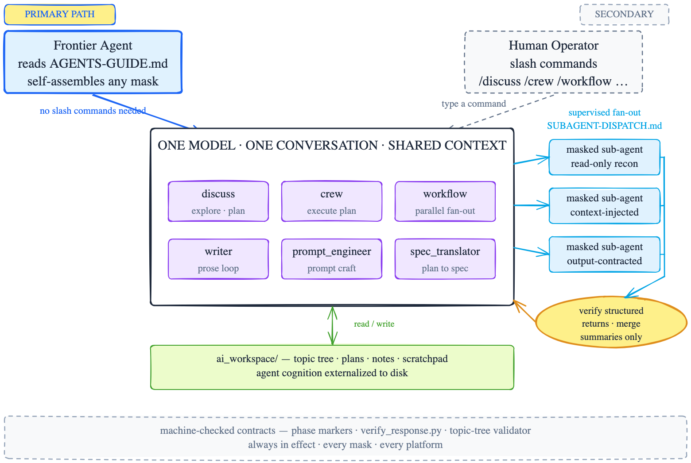

<p align="center">
  
</p>

<h1 align="center">cursor-agent-team</h1>

<p align="center">
  <b>The multi-role AI team your agent runs itself.</b><br>
  One model · one conversation · six role masks · zero cold handoffs.
</p>

<p align="center">
  
</p>

<p align="center">
  <a href="https://doi.org/10.5281/zenodo.18605311"></a>
  &nbsp; <b>Cursor</b> · <b>Claude Code</b> · <b>TRAE SOLO</b>
</p>

---

## A new era: agents that self-assemble — and self-discipline

cursor-agent-team (CAT) began as a set of slash commands that let one AI assistant wear
different role masks inside a single conversation. With **v0.22.0** the center of gravity
shifted: **the primary user is no longer the human typing commands — it is the frontier
agent itself.** With **v0.24.0** the next shift lands: the agent doesn't just wear masks —
**every state write passes through a script-enforced gateway, and every wrap-up follows a
machine-checked closing protocol.**

Modern frontier models enter a project cold, read the docs, and self-constrain. For them
CAT is not a command palette but an **operating discipline**: where the masks live, when
to adopt which one, how to dispatch sub-agents, and which machine-checked contracts to
honor — all readable directly from two files, no harness injection required. And since
v0.22.0 that discipline ships as **installable skills**: the same six masks, packaged so a
skill-aware host surfaces them in the agent's skill list every turn — the agent invokes
CAT itself, no human keystroke required.

> Humans are still first-class citizens: every slash command remains fully supported.
> But if your assistant is a frontier model, you may never need to type one again.

---

## For frontier agents (primary path)

Drop CAT into your project, install the skills, and the agent picks it up on its own:

```text
Read cursor-agent-team/AGENTS-GUIDE.md and adopt the role mask that fits this request.
Use cursor-agent-team/ai_workspace/ for all workspace writes.
```

That single instruction unlocks the full architecture:

| Capability | Entry point | What the agent gains |
|------------|-------------|---------------------|
| **Write gateway** (new in v0.24.0) | `_scripts/cat_write.py` | All state writes go through one script: global flock queue, atomic landing, journaled ops — the model never edits state files by hand |
| **Operation skills** (new in v0.24.0) | `writes` · `closing` · `doctor` · `dispatch` | HOW-to-act skills, orthogonal to masks: how to write state, how to wrap up, how to health-check, how to dispatch |
| **Closing protocol** (new in v0.24.0) | `_scripts/closing_protocol.py` | One command, five steps — tree verify, response verify, wrap-up note, snapshot, commit — stop at first failure |
| **Machine-checked contracts** | `_scripts/` | Phase markers, `verify_response.py` self-verification, topic-tree validator, scratchpad & leak guards |
| **Installable mask skills** (since v0.22.0) | `_skills/` → `.claude/skills/` / `.trae/skills/` | The six masks plus a master router, auto-discovered by skill-aware hosts every turn; agent self-invokes CAT |
| **Self-assembled masks** | [`AGENTS-GUIDE.md`](AGENTS-GUIDE.md) | Picks any of the six personas cold — no slash commands, no injection; includes a "which mask when" decision list |
| **Sub-agent dispatch** | [`SUBAGENT-DISPATCH.md`](SUBAGENT-DISPATCH.md) | Fans out mid-tier sub-agents with structured prompts, mask-based constraints, trust-but-verify acceptance |
| **Externalized cognition** | `ai_workspace/` | Durable topic tree, plans, notes, scratchpad — working memory beyond the context window |

### The write gateway: discipline by construction (new in v0.24.0)

Prompts constrain softly; scripts constrain hard. The gateway moves every state mutation
behind one executable door:

- **Global flock** — one writer at a time, kernel-managed queue, no model-side politeness needed
- **Atomic landing** — temp file + `os.replace`, a crash can never leave a half-written tree
- **Journaled ops** — every operation appends to a monthly JSONL journal: who, what, when
- **Whitelisted operations** — notes append, topic round, plan status, index rebuild; anything else is rejected

Pair it with the four **operation skills** and the agent gets a complete HOW-layer:
`/cat-writes` for state writes, `/cat-closing` for the five-step wrap-up,
`/cat-doctor` for deployment health checks, `/cat-dispatch` for sub-agent discipline.

### Skills: the per-turn handle

Slash commands are the mid-tier handle — a human must remember and type them. Skills are
the frontier-agent handle: **install once, and the host surfaces CAT in the agent's skill
list on every turn.** The mask skills carry YAML frontmatter (name + trigger-rich
description) so any frontmatter-discovering host — Claude Code, TRAE, or future ones —
can list them without configuration. Install paths: `install_claude_code.py` →
`.claude/skills/`, `install_trae_solo.py` → `.trae/skills/`. A guard clause in every
skill keeps the agent silent when `cursor-agent-team/` is absent, so a stray skill in
the wrong repo degrades to a one-line notice instead of misfiring.

---

## Architecture

<p align="center">
  
</p>

**Two ways in, one meeting room.** A frontier agent (primary, blue) and a human operator
(secondary, gray dashed) reach the same place: one model in one shared conversation wearing
role masks. When a plan calls for parallel work, the meeting room fans out read-only
sub-agents, verifies their structured returns, and merges only the summaries — the
shared-context core never fragments. Everything lands in `ai_workspace/` through the
write gateway, guarded by machine-checked contracts that are always in effect.

---

## For humans (secondary path)

All slash commands remain fully supported across Cursor, Claude Code, and TRAE SOLO:

| Role | Command | Purpose |
|------|---------|-------|
| Discussion Partner | `/discuss` | Explore ideas, clarify requirements, generate plans |
| Crew Member | `/crew` | Execute agreed plans strictly, step by step |
| Workflow Executor | `/workflow` (alias `/ultra`) | Supervised parallel execution via cross-platform sub-agents |
| Writer | `/writer` | Prose with Draft → Review → Final quality control |
| Prompt Engineer | `/prompt_engineer` | Create or maintain prompts, commands, new masks |
| Spec Translator | `/spec_translator` | Convert plans into spec-kit documents |

Because every mask lives in the same conversation, `/crew` already knows what `/discuss`
planned — no context handoff, no re-explaining.

---

## Quick start

```bash
# 1. Add as submodule inside your project
git submodule add https://github.com/thiswind/cursor-agent-team.git cursor-agent-team

# 2. Install for your platform
python3 cursor-agent-team/install.py              # Cursor
python3 cursor-agent-team/install_claude_code.py  # Claude Code (also installs skills → .claude/skills/)
python3 cursor-agent-team/install_trae_solo.py    # TRAE SOLO (also installs skills → .trae/skills/)

# 3a. On a skill-aware host the agent now sees CAT in its skill list   ← zero-keystroke
# 3b. Or point your frontier agent at AGENTS-GUIDE.md                  ← manual but universal
# 3c. Or type /discuss and start                                       ← classic
```

Or just tell your agent:

```text
Install cursor-agent-team into this project as a git submodule at cursor-agent-team/,
run the installer for my platform, then read cursor-agent-team/AGENTS-GUIDE.md.
```

---

## Why one conversation beats agent swarms

Every time one agent hands off to another, the receiving agent starts cold — it only knows
what you explicitly passed. Context bleeds, constrain softly, plans drift, you re-explain
yourself.

CAT keeps one model in one shared conversation and switches role masks instead. Switching
from planning to execution to prompt engineering loses nothing, because everyone in the
"meeting room" was there for the whole discussion. Parallelism is added only where it is
safe: supervised, read-only sub-agents that return structured summaries for verification.
And since v0.24.0 the meeting room has a bouncer: the write gateway guarantees every state
mutation is queued, atomic, and journaled.

---

## Features

- **Script-enforced write gateway** (new in v0.24.0) — global flock, atomic landing, JSONL journal; the model never edits state files directly
- **Operation skills** (new in v0.24.0) — `writes` / `closing` / `doctor` / `dispatch`: the HOW-layer, orthogonal to the six role masks
- **One-command closing protocol** (new in v0.24.0) — tree → verify → note → snapshot → commit, stop at first failure
- **Deployment doctor** (new in v0.24.0) — form / version / ignore-policy / orphan checks, `--fleet` for multi-host audits
- **Whitelist state tracking** (new in v0.24.0) — state files tracked by default, volatile zones excluded; hosts override via root `.gitignore`
- **Installable frontier-agent skills** (since v0.22.0) — the six masks plus a master routing skill as host-agnostic SKILL.md packages
- **Frontier-agent self-assembly** — `AGENTS-GUIDE.md`: advanced agents enter cold, pick a role mask themselves (officially supported since v0.20.0)
- **Supervised sub-agent dispatch** — `SUBAGENT-DISPATCH.md`: orchestrator-grade fan-out with trust-but-verify acceptance
- **Cross-platform parallel execution** — `/workflow` fans out read-only sub-tasks to native background agents; serial downgrade on older IDEs
- **Single conversation, multiple masks** — role switching without handoff or context loss
- **Shared AI workspace** — durable plans, notes, topic tree, scratchpad in `cursor-agent-team/ai_workspace/`
- **Script-backed constraints** — Python scripts for preflight, phase markers, topic-tree validation, workspace generation
- **Closed-loop verification** — `verify_response.py` machine-checks every response: phase markers, scratchpad freshness, leakage guard, stamps
- **Single-source commands** — all role commands generated from `commands.yaml`; `--check` gates drift in CI
- **Human-in-the-loop** — discussion, planning, execution stay under user control
- **Platform adapters** — Cursor, Claude Code, TRAE SOLO share one methodology
- **Optional extensions** — persona output, inspiration cards, TTS helpers, spec-kit translation

---

## Maintaining commands (single source)

Never hand-edit `_cursor/commands/`, `_claude/commands/`, or `_trae_solo/` artifacts:

```bash
python3 _scripts/build_commands.py         # regenerate all platform artifacts
python3 _scripts/build_commands.py --check # verify no drift (use in CI)
```

Generated commands embed the phase-marker and response self-verification contracts, so
every platform gets them for free.

---

## Installation

### Let an agent install it

```text
Install cursor-agent-team into this project as a git submodule at cursor-agent-team/,
then run the platform installer for my environment.

Use:
- Cursor: python3 cursor-agent-team/install.py
- Claude Code: python3 cursor-agent-team/install_claude_code.py
- TRAE SOLO: python3 cursor-agent-team/install_trae_solo.py
```

### Manual install / update / uninstall

```bash
git submodule add -f https://github.com/thiswind/cursor-agent-team.git cursor-agent-team
python3 cursor-agent-team/install.py              # or install_claude_code.py / install_trae_solo.py

git submodule update --remote cursor-agent-team   # update, then re-run installer
python3 cursor-agent-team/uninstall.py --platform cursor   # or claude_code / trae_solo
```

| Platform | Installer | What gets installed |
|----------|-----------|---------------------|
| Cursor | `install.py` | `.cursor/commands/` and `.cursor/rules/` |
| Claude Code | `install_claude_code.py` | `.claude/commands/` mask commands, `.claude/rules/` Writer rules, and skills → `.claude/skills/` |
| TRAE SOLO | `install_trae_solo.py` | `.trae/skills/` including Writer and an `AGENTS.md` template only when absent |

On Windows, use `py -3` instead of `python3`. Uninstall is recorded-file-only and safe for
user-owned files; the submodule remains unless `--remove-submodule` is passed. See
[DEPLOYMENT.md](DEPLOYMENT.md) for shapes, tracking policies, and upgrade SOPs.

---

## Paper

This repository is the reference implementation of:

> Hu, K. (2026). *cursor-agent-team: A Multi-Role, Single-Conversation Framework for Human-AI Collaboration*. Zenodo. https://doi.org/10.5281/zenodo.18605311

## Citation

```bibtex
@article{hu2026cursor,
  author    = {Hu, Kuang},
  title     = {cursor-agent-team: A Multi-Role, Single-Conversation Framework for Human-AI Collaboration},
  year      = {2026},
  publisher = {Zenodo},
  doi       = {10.5281/zenodo.18605311},
  url       = {https://doi.org/10.5281/zenodo.18605311}
}
```

---

## Version

Current version: **v0.24.0** — see [CHANGELOG.md](CHANGELOG.md).

## License

GNU General Public License v3.0 — see [LICENSE](LICENSE).

## Author

**thiswind** — [@thiswind](https://github.com/thiswind)
